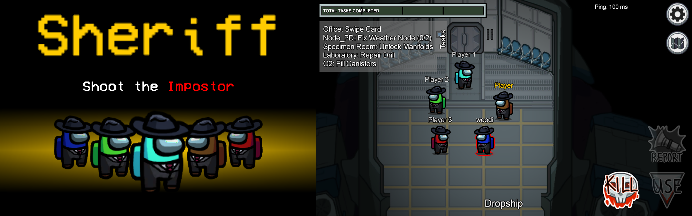

# Sheriff-Mod
Sheriff Mod is an Among Us modification for Windows, which adds a new Crewmate class to the game.
</img>

<h3>What does the Sheriff do?</h3>
He is able to kill Impostors. If he shoots a Crewmate, he will lose his life instead.
<h3>Additional Features</h3>
<ul>
<li> Visibility of the Sheriff can be set in the lobby game options menue</li>
<li> Playable on public Among Us Servers</li>
<li> Custom server regions to join private servers</li>
</ul>

<h2> Installation </h2>
<ul>
<li>Download the Mod for your specific game version. You are not able to launch the game if the versions do not match.</li>
<li>Make a copy of your game’s root directory (Steam/steamapps/common/Among Us) and rename it to whatever you want (Steam/steamapps/common/Among Us Sheriff Mod) </li>
<li>Extract the content of Among Us Sheriff Mod.zip into the copied folder you created</li>
<li>Open your modded folder and open the Game via Among Us.exe</li>
</ul>
 
<h2>Releases and Compatibility</h2>
 
 <table style="width:100%">
  <tr>
    <th>Among Us Version</th>
    <th>Mod Version</th>
    <th>Link</th>
  </tr>
   <tr>
    <td>v2020.12.9s</td>
    <td>v1.1</td>
    <td><a href="https://github.com/Woodi-dev/Among-Us-Sheriff-Mod/releases/download/v1.1/Among.Us.Sheriff.Mod.1.1.zip">Download</></td>
  </tr>
  <tr>
    <td>v2020.12.9s</td>
    <td>v1.01</td>
    <td><a href="https://github.com/Woodi-dev/Sheriff-Mod/releases/download/v2020.12.9s/Among.Us.Sheriff.Mod.1.01.zip">Download</></td>
  </tr>

</table>

  
Changelog

   <h3>v1.1</h3>
   <ul>
    <li>Added Sheriff kill cooldown option to the game lobby</li>
    <li>Added q shortcut to kill as Sheriff</li>
    <li>Kill distance of impostor and Sheriff are now the same/li>
    <li>Several bugfixes for nullpointer exceptions</li> 
   </ul>

<h2>Q&A</h2>
 

<b>Can you play Proximity Chat (Crewlink) with it?</b> 
Yes Crewlink does support Among Us Modifications.

<b>Can you get banned for playing on public Servers?</b> 
At the current state of the game there is no perma ban system for the game. The mod is designed in a way, that it does not send prohibited server requests.
You are also able to join your own custom server to be sure. <a href="https://github.com/Impostor/Impostor">(Impostor)</a>

<b>How can i join a custom server?</b> 
Go to your game directory and open BepInEx/config/org.bepinex.plugins.SheriffMod.txt. There you can set the hostname or IP of the server. Then set the server region to CUSTOM.

<b>Do my friends need to install the mod to play it together?</b> 
Yes. Every player in the game lobby has to install it.

<h2>Donate</h2>

<a href="https://www.paypal.com/donate?hosted_button_id=TWGK7A9VBVPRU"></img></a>

I would appreciate any donations. This will help me to develop more mods.

For exclusive modding requests contact me: <a href="mailto:Woodi-dev@gmx.de">Woodi-dev@gmx.de</a>
<h2>License</h2>

This software is distributed under the <b>GNU GPLv3</b> License.
<a href="https://github.com/BepInEx/BepInEx">BepinEx</a> is distributed under <b>LGPL-2.1</b> License.

